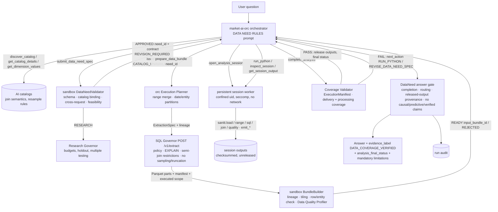

# DataNeed architecture — implementation report

Status on 2026-09-26: phases 0–6 implemented; the DataNeed flow is **on in Railway `dev`** with `lookup_fact`
disabled. The Analysis Spec path remains in the code as the rollback until the dev soak test ends (see
[Exit plan](#exit-plan)). Production was not touched.

## 1. Architecture before the change (baseline `main@b40d66e`)

```
model -> create_analysis_spec          market-ai-orc app/tools/analysis.py (CreateAnalysisSpecArgs)
      -> sandbox POST /v1/specs        market-python-sandbox app/service.py create_spec: spec.py / spec_v2.py,
                                       intent.py review, Governor POST /v1/catalog/contract,
                                       research_policy.py (Research Governor) -> spec_id + data_plan
      -> prepare_analysis_data         market-ai-orc app/tools/data_compiler.py (DataRequestCompiler: raw columns,
                                       joins, flat AND filters, <= 16 date partitions)
                                       -> Governor POST /v1/query (app/policy.py gates, app/compiler.py, EXPLAIN,
                                       app/snapshot.py Parquet + manifest) -> in-memory BundleStore (orc)
      -> run_python_analysis           one-shot job: app/executor.py + runtime/runner.py (confined child);
                                       preflight/postflight runtime/validator.py + runtime/reference.py
                                       recalculation; app/outputs.py fixed TABLE/METRICS/CHART/ARTIFACT
      -> orc gates                     app/orchestrator.py validation gate, routing guard, app/provenance.py
                                       number provenance, claim gate, evidence_label -> app/audit.py
lookup_fact: orc app/tools/request_data.py -> Governor POST /v1/lookup, on by default.
```

The problems the DataNeed architecture addresses:
- the model had to encode calculations, methods, output grains and formula references in a data request;
- the backend re-derived the calculation in order to validate it;
- one-shot scripts could not inspect, fix and rerun;
- relationships had no point-in-time semantics;
- partitioning was limited to dates.

Test baseline: market-ai-orc 409, market-sql-governor 159, market-python-sandbox 310 passed.

## 2. Keep / refactor / replace / retire

| Component | Decision | Actual state |
|---|---|---|
| Catalog tools (`discover_catalog`, `get_catalog_details`, `read_catalog_rows`, `preview_table_rows`, `get_dimension_values`) | Keep + refactor | Unchanged tools. The catalog contract now carries `supported_join_semantics`, time/effective columns and `resample_aggregation` (migration `20260925_003`) |
| AnalysisSpec V2 (sandbox `spec.py`, `spec_v2.py`; orc `create_analysis_spec`) | Replace | Replaced model-facing by `data_need_spec/v1` when `AI_ENABLE_DATANEED` is on; code kept as rollback |
| Spec reviewer (`intent.py`) | Retire | Not used by the DataNeed flow; kept for the rollback path |
| Research Governor | Keep + refactor | New `app/research_governance.py` takes a ResearchGovernanceRequest (hypothesis, candidates, comparisons, multiple-testing policy, holdout, minimum sample). No method or formula coupling |
| DataRequestCompiler (orc) | Refactor → replace | `app/tools/data_planner.py` ExecutionPlanner works from the approved DataNeed contract; the old compiler stays for rollback |
| SQL Governor gates, EXPLAIN, snapshots | Keep + extend | New `POST /v1/extract` (`app/extract.py`, `Extractor` in `app/governor.py`) reuses the gates, row caps and dataset store |
| Orc in-memory BundleStore | Replace | Governed bundles persisted by the sandbox (`app/bundles.py`, SQLite + checksum-verified files, 0444 under `/data/bundles`) |
| Sandbox confinement (`confine.py`, seccomp) | Keep | Reused for the profiler and the persistent session workers |
| `saniti` helpers | Keep + extend | `runtime/saniti_session.py`: `load`, `range`, `sql`, `relation`, `join`, `resample`, `quality`, `requests`, `manifest`, `insufficient_data`, `emit_*` |
| Validator / reference calculations (`runtime/validator.py`, `runtime/reference.py`) | Refactor / retire | Not part of the DataNeed completion. Coverage lives in the standalone `app/coverage.py`, and calculation validation is `NOT_PERFORMED`. Kept for the rollback path |
| Model-facing tools | Replace | `submit_data_need_spec`, `prepare_data_bundle`, `open_analysis_session`, `run_python`, `inspect_session`, `get_session_output`, `complete_analysis` |
| `lookup_fact` | Retire (flag) | `AI_ENABLE_LOOKUP_FACT=false` in dev after the parity test; tool code and Governor `/v1/lookup` kept for rollback |
| Audit (`app/audit.py`, `AI_research_run_audit`) | Keep | DataNeed runs are audited, and research needs appear as experiments |

## 3. Implemented architecture



- **DataNeedSpec (`data_need_spec/v1`).** The model declares only data:
  - logical requests: table, columns, a scope tree up to depth 4 (AND/OR/NOT/PREDICATE), named time ranges, source and analysis frequency with explicit `resample`, history/future buffers, ordering;
  - catalog relationships with join semantics.

  It carries no formula, method, indicator or output. The validator is `app/data_need.py` (`validate` line 768, `approved_contract` line 786).
- **Approved contract.** Per request:
  - extract columns (keys first) and the canonical scope with its hash;
  - extraction windows widened by the buffers;
  - resample rules;
  - restrictions and the catalog hash.

  An INNER relationship restricts both requests, each by the other request's own scope. The exact join runs in the session through `saniti.join`. The reference side of AS_OF/EFFECTIVE_DATED keeps its own scope.
- **Execution Planner** (`app/tools/data_planner.py`, `ExecutionPlanner` line 123):
  - merges overlapping ranges into envelopes;
  - splits into date or entity-hash partitions (at most 64 per request) on `APPROVED_WITH_PARTITIONING`;
  - stops at the first `REJECTED_*` with the request named.
- **Governor `POST /v1/extract`** (`app/extract.py`: `bind` line 399, `_restriction_sql` line 484, `partitioning` line 588):
  - parameterized scope SQL and EXISTS semi-joins (CURRENT_STATE, EXACT_DATE, AS_OF, EFFECTIVE_DATED);
  - deterministic ordering;
  - EXPLAIN without LIMIT, and index-aware partition advice;
  - statuses `APPROVED`, `APPROVED_WITH_PARTITIONING` and `REJECTED_*`;
  - `executed_scope` with `sampling: false`, `truncation: false`.
- **Governed bundle** (`app/bundles.py` `BundleBuilder`, `app/coverage.py` `delivery_coverage` line 150, `runtime/profiler.py`):
  - lineage and executed-scope check per part;
  - date × entity-residue tiling;
  - row and `entities_sha256` equality against the SQL manifest;
  - a Data Quality Manifest (nulls, duplicate keys, empty/partial ranges, frequency gaps, buffer shortfalls, empty entities).
- **Sessions** (`app/sessions.py` `SessionManager` line 192, `runtime/session_worker.py`):
  - one confined worker per session (uid 20201+);
  - variables and functions persist;
  - SIGINT on timeout, SIGKILL after grace;
  - watchdog, janitor, and orphans closed on restart.
- **Completion** (`app/dataneed_service.py` `complete` line 248, `app/coverage.py` `processing_coverage` line 248):
  - the ExecutionManifest from harness records;
  - every approved request and range must be read in full through the helpers in a successful execution, with at least one output;
  - final status with `calculation_validation: NOT_PERFORMED`;
  - outputs released and the session closed only on PASS.
- **Orchestrator** (`app/orchestrator.py`: `DATANEED_RULES` line 198, `_track_dataneed` line 945, `_dataneed_gate` line 1091, `_claim_problem` line 1134):
  - exclusive DataNeed tools;
  - the gate: completion → routing → released-output provenance (`DATA_COVERAGE_VERIFIED`) → claims (causal, predictive and "calculation verified" wording are always refused);
  - mandatory limitations;
  - `execution.analysis_final_status`.

## 4. Files changed (`b40d66e..HEAD`, 52 files, +9,665 / −43 lines)

- **market-ai-orc**
  - New: `app/tools/data_need.py`, `app/tools/data_planner.py`, `app/tools/session.py`, `tests/test_data_need_tool.py`, `tests/test_data_planner.py`, `tests/test_session_tools.py`, `tests/test_dataneed_orchestrator.py`.
  - Changed: `app/orchestrator.py`, `app/provenance.py`, `app/schemas.py`, `app/config.py`, `app/main.py`, `app/tools/__init__.py`, `app/tools/analysis.py`, `app/tools/registry.py`, `app/tools/request_data.py`, `app/tools/system.py`, `tests/test_api.py`, `README.md`.
- **market-python-sandbox**
  - New: `app/data_need.py`, `app/dataneed_service.py`, `app/dataneed_store.py`, `app/research_governance.py`, `app/bundles.py`, `app/sessions.py`, `runtime/profiler.py`, `runtime/saniti_session.py`, `runtime/session_worker.py`, and tests `dataneed_fixtures.py`, `test_dataneed_validator.py`, `test_dataneed_service.py`, `test_dataneed_bundles.py`, `test_dataneed_sessions.py`, `test_dataneed_completion.py`.
  - Changed: `app/config.py`, `app/coverage.py`, `app/main.py`, `Dockerfile` (session users), `tests/conftest.py`, `README.md`.
- **market-sql-governor**
  - New: `app/extract.py`, `tests/test_extract.py`.
  - Changed: `app/governor.py`, `app/main.py`, `app/config.py`, `app/catalog_contract.py`, `app/datasets.py`, `tests/conftest.py`, `tests/fixture.py`, `README.md`.
- **Database:** `database/migrations/20260925_003_add_relationship_join_semantics.sql`, `database/migrations/20260926_001_register_dataneed_tools.sql`.
- **Docs and IaC:** `.railway/railway.ts`, `DATABASE_SCHEMA.md`, `DATABASE_CATALOG.md`, `DATABASE_CHANGELOG.md`, `RAILWAY_CHANGELOG.md`, this file.

## 5. Database migrations (both additive, applied to `dev`, read back live)

| Migration | Change | Status |
|---|---|---|
| `20260925_003_add_relationship_join_semantics.sql` | 5 columns on `AI_catalog_relationships` and 1 on `AI_column_catalog`, 4 check constraints; seeds CURRENT_STATE/EXACT_DATE on the five relationships; no resample rule; 6 `Column_Catalog` rows | Applied 2026-09-26 (deployment `f6ef3174`); `DATABASE_SCHEMA.md` refreshed |
| `20260926_001_register_dataneed_tools.sql` | 7 inactive `Tool_Catalog` rows (`complete_analysis` as `orc-v1`), `dataneed_flow` notes on the 5 replaced tools | Applied 2026-09-26 (deployment `c4c3d6c2`); 55 → 62 rows, active still 25 |

No destructive change, backfill, market-data write, grant or role change was needed.

## 6. API and schema contracts

- **Sandbox**, all 404 without `PY_SANDBOX_DATANEED_ENABLED`:
  - `POST /v1/data-needs` and `GET /v1/data-needs/{need_id}`;
  - `POST /v1/bundles` and `GET /v1/bundles/{bundle_id}`;
  - `POST /v1/sessions`, `POST /v1/sessions/{id}/execute`, `POST /v1/sessions/{id}/inspect`, `GET /v1/sessions/{id}`, `GET /v1/sessions/{id}/outputs/{output_id}`, `POST /v1/sessions/{id}/complete`, `POST /v1/sessions/{id}/close`.

  Every session call carries the run's `request_id`, and sessions are bound to it.
- **Governor:** `POST /v1/extract` takes `{request_id, extraction, lineage, planned_parts}`, with the orc key only. `POST /v1/catalog/contract` adds the join and resample fields when present.
- **Orc response:** `execution.analysis_final_status`, and `evidence_label` gains `DATA_COVERAGE_VERIFIED`, which ranks between `SCOPE_VERIFIED` and `UNVERIFIED_EXPLORATORY`.
- **Final status:** `data_need_validation`, `research_governance`, `sql_governance`, `data_quality_profiling`, `data_coverage`, `sandbox_execution`, `calculation_validation` (always `NOT_PERFORMED`), `data_complete`, `execution_complete`, `evidence_label`, `warnings`, `claims_allowed`, `claims_forbidden`, `research_constraints`.

## 7. Model-facing tools (with `AI_ENABLE_DATANEED`)

`get_system_capabilities`, `discover_catalog`, `get_catalog_details`, `read_catalog_rows`, `preview_table_rows`, `get_dimension_values`, `submit_data_need_spec`, `prepare_data_bundle`, `open_analysis_session`, `run_python`, `inspect_session`, `get_session_output`, `complete_analysis`. `lookup_fact` is added only if `AI_ENABLE_LOOKUP_FACT` is true (false in dev).

**No longer model-facing** while the flag is on:
- `create_analysis_spec`, `prepare_analysis_data`, `run_python_analysis`, `get_analysis_result` and `get_dataset_manifest`;
- `lookup_fact` (flag off in dev);
- `request_data`, already off.

## 8. Orchestration behavior

- The prompt keeps the common catalog and discovery rules and replaces DATA QUERY RULES with DATA NEED RULES. The prefix stays byte-identical per deployment, so the prompt cache is kept.
- The gate rejects each problem once while tools are available, then forces a LIMITATION:
  1. an answer resting on a session that ran code without a completion, or with an INCOMPLETE one;
  2. a statistic without a COMPLETED analysis;
  3. numbers without a governed source;
  4. causal, predictive or "calculation verified" wording.
- Revisions: `REVISION_REQUIRED` issues go back to the model, which resubmits with `revision + 1`. A catalog outage or `REVISION_CONFLICT` uses no revision.
- Research: answered as "pola historis" only. Needs appear in `execution.research.experiments` and in the audit.

## 9. Tests (final runs on the final code)

| Suite | Baseline | Now |
|---|---|---|
| market-ai-orc | 409 passed | **454 passed** |
| market-sql-governor | 159 passed | **193 passed** (incl. 34 `test_extract.py`) |
| market-python-sandbox | 310 passed | **436 passed** (incl. 126 DataNeed: validator, service, bundles, sessions, completion) |

The migrations were rehearsed on disposable PostgreSQL 16 databases: apply, readback, refused reruns and refused invalid values.

## 10. End-to-end PoC results

- **Local, real model** (deepseek-v4.1-flash) against the local Governor and sandbox, synthetic data. Five questions: YTD by industry, RSI-14, weekly volume, fact, count per sector.
  - All completed, and every number equals the independently computed ground truth.
  - This rehearsal found the INNER-orientation bug fixed in `4aa3272`.
- **Railway `dev`, real model, real data:** 6 PoC questions plus 3 parity questions. Every answer equals the SQL/pandas ground truth, and 0 numbers were unsupported. Details and deployment ids are in `RAILWAY_CHANGELOG.md` (2026-09-26).
  - Analysis: YTD of the 48 bank stocks against the same period last year (INNER join, three warnings disclosed).
  - Research: BBCA's 10-day return after RSI < 30. Reported as a historical pattern; the unmet minimum sample, missing holdout and missing correction were disclosed.
  - Static count per sector; weekly volume; top 10 one-month returns across 843 tickers (FREQUENCY_GAPS disclosed).
  - `lookup_fact` parity, value/AVG/MAX: identical values with the tool on and off.

## 11. Performance and resource observations

- **Dev latency:** 14–37 s for facts, counts and weekly figures; 140–240 s for multi-request analyses and research. That is 8–18 tool calls at $0.002–$0.017 per answer, with cached input about 90% on the local runs.
- **DataNeed facts vs. `lookup_fact`:** 2–7× slower and up to 7× costlier for a single value; about the same for aggregates.
- **Bundle sizes seen:** 4,296 rows (YTD, 12 synthetic tickers), 472 rows (2-year RSI), and 843 tickers × about 21 days (one month). No partitioning was needed at the dev limits.
- **Sandbox:** `isolation_enforced=true`. Sessions are limited to 2 concurrent per sandbox, with 900 CPU-seconds, 40 executions and a 60-minute lifetime per session. Session memory on Railway was not measured separately.

## 12. Dev deployment status (verified)

| Service | Deployment | Commit / change | Status |
|---|---|---|---|
| market-python-sandbox | `e9faab10-bf91-40bb-a620-40d5b48b4e43` | `4aa3272` + `PY_SANDBOX_DATANEED_ENABLED=true` | `SUCCESS`, `/ready` 200, isolation enforced |
| market-sql-governor | `2136ce9e-f54f-4d5a-80e6-611df5348647` | `4aa3272` | `SUCCESS`, `/ready` 200 |
| market-ai-orc | `5e1e3dd4-6410-4c78-bee4-0fcf4001995a` | `6cf93d2`, with `AI_ENABLE_DATANEED=true`, `AI_ENABLE_LOOKUP_FACT=false` | `SUCCESS`, `/ready` 200 |

Active DataNeed flags in `dev`: `PY_SANDBOX_DATANEED_ENABLED=true`, `AI_ENABLE_DATANEED=true`, `AI_ENABLE_LOOKUP_FACT=false`. Temporary jobs were deleted, and `railway config plan` shows only the three accepted legacy source drifts.

## 13. Remaining risks

1. **No soak test yet.** Real traffic may surface prompt or flow failures that the PoCs did not.
2. **Point-in-time joins are only partly live.** AS_OF and EFFECTIVE_DATED are covered by fixture tests only; no catalog table keeps reference history, so historical classifications use the current state (warned).
3. **No resample rule in the catalog** (`resample_aggregation` is NULL everywhere). Every resampling happens in the session and is not pushed down.
4. **Calculations are the model's own.** The backend verifies data coverage, not formulas (`calculation_validation: NOT_PERFORMED`). The provenance and claim gates limit what an answer may state, but a wrong formula over complete data is not caught.
5. **Capacity.** At most 2 concurrent sessions, and sessions die with a sandbox restart; bundles persist and the model must reopen. Long research runs take about 4 minutes.
6. **Restrictions are one level deep.** A superset is delivered for chained INNER relationships, so there is more data but it is never less.
7. **Cost of facts.** Simple facts cost more without `lookup_fact`.
8. **Legacy code still present.** Two paths must be maintained until the exit plan completes.

## 14. Rollback procedure

1. **Switch the flow off** (instant, no data change): delete `AI_ENABLE_DATANEED` on market-ai-orc (redeploys), then delete `PY_SANDBOX_DATANEED_ENABLED` on market-python-sandbox. The Analysis Spec path, prompt and gate return unchanged.
2. **Restore facts:** delete `AI_ENABLE_LOOKUP_FACT` (default true) on market-ai-orc. `/v1/lookup` was never removed.
3. **Code:** redeploy the phase 2 deployments (sandbox `c2ab2125`, orc `df85aac2`), or revert `4aa3272` / `daa05cc` on `main`.
4. **Database** (forward-only policy): new migrations would drop the six catalog columns and their `Column_Catalog` rows, and delete the seven inactive `Tool_Catalog` rows and the `dataneed_flow` key. The deployed services read the columns only when present; no other data depends on them.
5. `/data/dataneed.sqlite3`, bundles and session outputs stay on the sandbox volume as the audit record. The janitor expires them by retention.

## Exit plan

The Analysis Spec path is a compatibility layer with an end date. It is removed once the **dev soak test** passes:
- at least 7 days with the flags on in `dev`;
- at least 30 real questions across analysis, research, facts and static counts;
- no rollback;
- no answer with an unsupported number;
- no unhandled `REJECTED_*` without a revision path.

The removal then happens in one change that is reviewed, tested and deployed:
- orc: `create_analysis_spec`, `prepare_analysis_data`, `run_python_analysis`, `get_analysis_result`, `get_dataset_manifest`, the DATA QUERY RULES prompt, the legacy validation gate and `data_compiler.py`; `lookup_fact`, if the soak confirms parity;
- sandbox: `/v1/specs`, `/v1/analyses`, `spec.py`/`spec_v2.py`, `intent.py`, `runtime/validator.py`, `runtime/reference.py` and the fixed output contract (`app/outputs.py`), and the dead status codes those carried (`ANALYSIS_SPEC_MISMATCH`, `CALCULATION_MISMATCH`, `CALCULATION_VERIFIED` levels);
- Governor: `/v1/query`, the dataset manifest endpoint and `/v1/lookup`, if nothing else calls them;
- the `AI_ENABLE_DATANEED` and `PY_SANDBOX_DATANEED_ENABLED` flags themselves, with the DataNeed flow becoming the only path;
- `Tool_Catalog`: the replaced rows get `superseded_by`.

Until then no new feature is added to the Analysis Spec path.

## Acceptance criteria (§26)

| # | Criterion | Status | Evidence |
|---|---|---|---|
| 1 | The model-facing request uses DataNeedSpec | Met (dev) | exclusive registry test; dev PoC |
| 2 | No formula, calculation enum or output grain | Met | strict schema, validator schema layer tests |
| 3–4 | Multiple logical requests; multiple ranges | Met | YTD PoCs (2 requests, 2 ranges) |
| 5 | Scope expression tree | Met | depth-4 AND/OR/NOT tests, canonical scope |
| 6 | Point-in-time relationships | Partly live | CURRENT_STATE/EXACT_DATE live; AS_OF/EFFECTIVE_DATED fixture-tested (approved decision 3) |
| 7–8 | Source vs. analysis frequency; explicit resampling | Met | `RESAMPLE_REQUIRED`/`RESAMPLE_INVALID` tests; `saniti.resample` |
| 9–11 | Approved statuses; issue shape; no catalog candidates | Met | validator and service tests |
| 12–14 | Physical ExtractionSpec by backend; Governor gates retained; no sampling/truncation | Met | `test_extract.py`, planner tests, executed-scope checks |
| 15–19 | Quality manifest; persistent interactive sandbox; inspection; full programmatic processing; flexible outputs | Met | session and bundle tests; dev PoC |
| 20–22 | Standalone coverage; no recalculation; `NOT_PERFORMED` | Met | `app/coverage.py`, completion tests |
| 23 | Research Governor without backend formulas | Met | `app/research_governance.py` tests; RSI research PoC |
| 24 | `lookup_fact` can be disabled | Met | dev parity test |
| 25 | Isolation and resource limits enforced | Met | `isolation_enforced=true`; session uid/seccomp tests |
| 26 | Analysis and research PoCs end-to-end | Met | dev PoC |
| 27 | Unrelated services and data untouched | Met | only the catalog columns and rows and the `Tool_Catalog` rows above changed |
